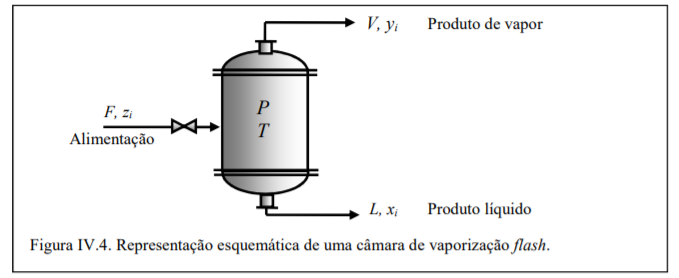
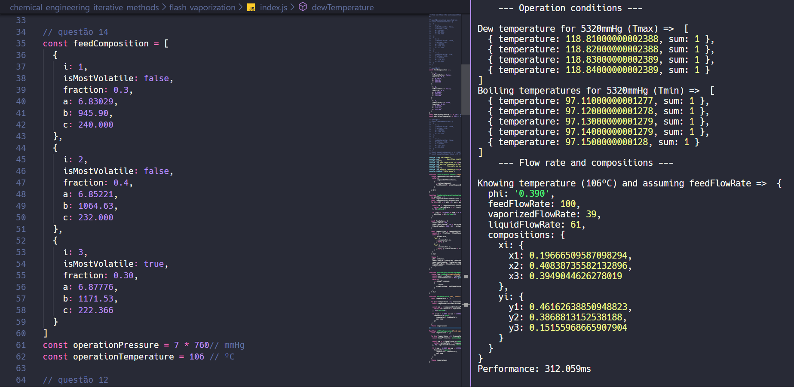

# Chemical engineering calculations

By the fact that I think that chemical engineering is way more than just repetitive calculus in my calculator, I decided to code some scripts to help me doing what really matters - **think**. 

✌️✌️

## index
1. [Functions](#Functions)
2. [Tutorial](#How-can-I-use-this??-wtf???)

## Functions

### Flash vaporization

#### REMEMBER!
> xi => composition of liquid flow rate 

> yi => composition of vaporized flow rate

1. Operation conditions - Boiling and Dew temperatures - knowing operation pressure

2. Flow rate and compositions knowing 
- Operation conditions (Pressure and Temperature);
- Feed composition
- assuming a feed flow rate as calculation basis (100)

## How can I use this?? wtf???

1. [Download NodeJS ](https://nodejs.org/pt-br/download/), it'll run this code in your computer
2. Put on a [really good song](https://youtu.be/29LwM9Xa6l8?t=601) while you wait - thank me later
3. Download this repository to your computer

4. Put up your data in the code in one of those ways:
    - In your favorite IDE (hey, coder!)
    - By clicking with the right button in the file (index.js) and click in edit.

    _**You should edit just these 3 constants**_ (Hope you know those values): 
    - feedComposition
    * operationPressure 
    - operationTemperature 

5. Remember to save your file after editing it

6. Open your terminal (PowerShell for windows) and go to your downloaded chemical engineering folder [(Tutorial for navigation in Windows PowerShell)](https://docs.microsoft.com/en-us/windows-server/administration/windows-commands/cd)
7. Verify that node is installed by running this command:

        >node --version

    Expected result: (note that the version actually doesn't matter for this repository):
    
        >v10.16.3  

8. Now that you noticed yourself as a hacker, change your music to [this song](https://www.youtube.com/watch?v=XMEXPkPmmq0) and run this in your command line

        > node (what you want here)

    Example in PowerShell: 

        > node .\flash-vaporization\

    Will print in your terminal a lot of numbers that that just you and your chemical engineering friends will care about

        > --- Operation conditions ---
        Dew temperature for 760mmHg (Tmax) =>  [
          { temperature: 88.60000000000842, sum: 1 },
          { temperature: 88.61000000000843, sum: 1 },
          { temperature: 88.62000000000843, sum: 1 }
        ]
        Boiling temperatures for 760mmHg (Tmin) =>  [
          { temperature: 78.61000000000331, sum: 1 },
          { temperature: 78.62000000000332, sum: 1 },
          { temperature: 78.63000000000332, sum: 1 }
        ]
            --- Flow rate and compositions ---
        Knowing temperature (80ºC) and assuming feedFlowRate =>  {
          phi: '0.212',
          feedFlowRate: 100,
          vaporizedFlowRate: 21.2,
          liquidFlowRate: 78.8,
          compositions: {
            xi: { x1: 0.6548044373839677, x2: 0.34519644061887117 },
            yi: { y1: 0.8679910534973276, y2: 0.13200568298268642 }
          }
        }
        Performance: 246.506ms

Hope you don't need to contact me, but if you do, [click here](https://github.com/viniaxt/chemical-engineering/issues) and 